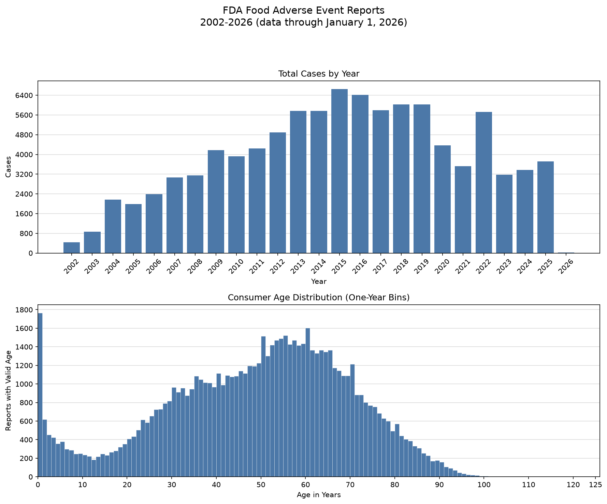

# FDA Food Safety Data Pipeline

Downloads FDA food adverse-event reports for January 1, 2002 through January 1,
2026, then filters, summarizes, and visualizes the downloaded data.

Data comes from the [openFDA Food Event API](https://open.fda.gov/apis/food/event/)
using its [cursor-based paging](https://open.fda.gov/apis/paging/).

The repository includes a completed snapshot containing **97,652 reports across
987 JSON page files**. The final 2026 interval contains January 1 only.

## Requirements

- Node.js 18 or newer. Part 1 uses Node's built-in `fetch` and has no package
  dependencies.
- Python 3.9 or newer.

Install the required Python libraries in a virtual environment:

```bash
python -m venv .venv
```

Activate it with `.\.venv\Scripts\Activate.ps1` in Windows PowerShell or
`source .venv/bin/activate` on macOS/Linux, then install the dependencies:

```bash
python -m pip install -r requirements.txt
```

If it is not activated, replace `python` below with `.venv/bin/python` on
macOS/Linux or `.\.venv\Scripts\python.exe` on Windows.

## Part 1: Download the FDA data

```bash
node part1.js
```

The downloader:

- requests exactly 100 records at a time;
- divides the fixed range into 24 disjoint date windows;
- processes three windows concurrently by default while following each window's FDA
  cursor sequentially;
- applies shared request pacing, 30-second timeouts, and bounded retries for temporary
  network failures and HTTP 408, 429, 500, 502, 503, and 504 responses;
- validates dates, report identifiers, cursor links, and reported totals; and
- publishes `data/manifest.json` as complete only after all files and counts reconcile.

`CONCURRENCY_LIMIT` accepts any positive integer. `OPENFDA_API_KEY` is optional:

```powershell
$env:CONCURRENCY_LIMIT = "3"
$env:OPENFDA_API_KEY = "your-openfda-api-key"
node part1.js
```

The script deliberately refuses to overwrite an existing `data` directory. Because
this repository includes the completed download, move that directory somewhere safe
before testing a fresh ingestion. Interrupted and failed runs retain an incomplete
manifest and are not treated as analysis-ready; resume support is not implemented.

## Part 2: Analyze and visualize

Run the overall analysis:

```bash
python part2.py
```

Arguments may appear in any order:

```bash
python part2.py 2022
python part2.py 2022 2023
python part2.py CARROTS
python part2.py 2024 2026 CARROTS
python part2.py CARROTS 2026 2024
```

- No year analyzes 2002 through the end of the downloaded snapshot.
- One year analyzes that year through the snapshot end.
- Two years select an inclusive range; their argument order does not matter.
- All remaining words form one case-insensitive substring filter. A report matches
  only when the text occurs in a product whose FDA role is `SUSPECT`.
- In a filtered product ranking, only matching suspect products are counted.

Here, “Present” means the fixed Part 1 snapshot ending January 1, 2026. Exact
four-digit arguments are interpreted as years, so a standalone four-digit product
name is ambiguous in this positional interface.

The command prints:

1. total matching records;
2. up to 25 outcomes;
3. up to 25 reactions;
4. up to 25 suspect products; and
5. total, female, and male average consumer ages.

Each term is counted at most once per report after deterministic Unicode, case,
whitespace, punctuation, and apostrophe cleanup. Narrow aliases consolidate inspected
Vitamin D, NatureMade, and soft-gel variants. Fuzzy matching is intentionally avoided
because dosage, formulation, cancer stage, and clinical qualifiers can change meaning.

Ages expressed in years, months, weeks, days, or decades are converted to years.
Missing, malformed, non-finite, negative, unsupported, and converted ages above 125
are excluded from age calculations. Valid records with unknown gender contribute to
the total average but not the female or male averages.

Every successful run also writes `charts/<execution-timestamp>.png` with two subplots:

- total cases for every year in the selected range, including zero-count years; and
- valid consumer ages in one-year-wide histogram bins.

The analyzer refuses incomplete manifests, missing or malformed listed files,
non-contiguous date coverage, count mismatches, out-of-window records, and duplicate
report identifiers instead of presenting a partial download as complete.

## Repository layout

- `part1.js` — concurrent, cursor-based FDA downloader.
- `part2.py` — command-line analysis and visualization tool.
- `requirements.txt` — Python dependency ranges.
- `data/manifest.json` — completion record and page inventory.
- `data/<date-window>/` — original FDA response pages.
- `charts/` — timestamped two-panel analysis output.


